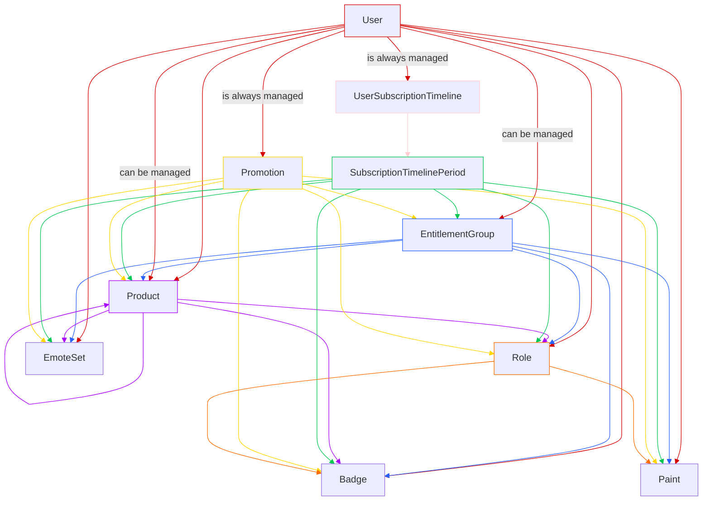

# Entitlements

## Overview

This is a POC for how entitlements might work in the future. 

## How it works

We use a graph to represent the entitlements. Each node in the graph is a permission, and each edge is a relationship between the permissions.



This might look a bit complicated, but it's actually quite simple. See (requirements.md)[./requirements.md] for our requirements.

### tl;dr on requirements:

- A user can be directly assigned items such as roles, badges, paints and emote sets.
- A user can be assigned items through a role. (think of how the moderator role might give a user a badge)
- A user can be assigned items through a product. (think of how a user might purchase a product that gives them a role / paints / badges)
- A user can be assigned items through a subscription, and there can be conditional requirements such as the user must have been subscribed for a certain amount of time to get this entitlement. (think of a 3 month subscriber badge)
- A user can be assigned items for performing an action, such as gifting x amount of items during a certain time period. (think of the x-mas gifter badge)

### constriants:

The problem is how do we design a system that allows for:
- Fast rollout of new entitlements
- Easy management of entitlements (you can undo if you make a mistake)
- Fast to compute what entitlements a user has
- Entitlements are given out by a reliable set of rules. (no manual assignment) and if the rules change, the entitlements are updated automatically for all users.

### old system:

The old system essentially gave out all entitlements to all users that met the requirements at the time it was checked. Inserting the entitlements took a long time as we had to insert an entitlement for every user. We had countless problems where users were missing entitlements because the entitlements were not inserted correctly, or they had duplicate entitlements because the entitlements were inserted twice. 

We also have no way of removing someones entitlments if they refunded a product that initially gave them the entitlements.

This new system is designed to solve these problems.

## new system:

As mentioned the new system is a graph design. A user has a edge to a group of entitlements, this group would contain all the entitlements that whatever condition the user met would give them. 

Edges have a:

- `from` node
- `to` node

In most cases the `from` node is who is responsible for managing the edge, and should check if the user still meets the requirements for the entitlements.

The `to` node is the entitlements that the user will get if they meet the requirements.

The `to` node could be another group of entitlements, which would allow for a tree like structure of entitlements.

For example:

`User` -> `Moderator Role` -> `Moderator Badge`
`User` -> `Subscription` -> `3 month subscriber perk` -> `3 month subscriber badge` & `3 month subscriber paint`
`User` -> `Subscription` -> `January Paint Bundle` -> `January Paint 1` & `January Paint 2` & `January Paint 3`

We would need an edge between the user and the moderator role which would imply that the user has the moderator role, and when we traverse the graph we would see that the user has the moderator badge.

We would need an edge between the user and the subscription (their sub must be active). Once they reach 3 months the subscription would then make the edge between them and the 3 month subscriber perk, which would then give them the 3 month subscriber badge and paint (in theory).

We would need an edge between the user and the subscription (their sub must be active), however if they were subscribed in January, we would then make an edge between them and the January Paint Bundle, which would then give them the January Paints. 

### How do we check if a user has entitlements?

Since this is a directed graph we simply go `OUTBOUND` from the user node and go until there are no more edges to traverse.

### How do we check what users have entitlements?

Similarly to the above we would go `INBOUND` from the entitlement node and go until there are no more edges to traverse.

### How do we update entitlements?

We can add or remove edges from the graph and it will instantly update the entitlements for all users who are connected to the edge somehow.

### Thats cool what does this look like in code?

```rs
struct Edge {
    from: EdgeKind,
    to: EdgeKind,
}

enum EdgeKind {
    User(User),
    Role(Role),
    Badge(Badge),
    Paint(Paint),
    Subscription(Subscription),
    /// etc
}

let mut starting_nodes = vec![EdgeKind::User(user)];

let mut visited = HashSet::new();

while !starting_nodes.empty() {
    let next_nodes = db.query("SELECT * FROM edges WHERE from IN $1", starting_nodes);
    starting_nodes.clear();
    for edge in next_nodes {
        if visited.insert(&edge.to) {
            continue;
        }
        starting_nodes.push(edge.to);
    }
}
```

So we recursively traverse the graph until we have no more edges to traverse.

### Is that performant?

Yes. We are doing indexed lookups. In the example I showed a SQL query but in reality we use mongodb. We can also do dataloading on this as well which will amortize the cost of the lookups over multiple requests.

#### Why not use a graph database?

We tested initially with a few graph databases however surprisingly they are not very performant on terversal queries. I imagine that if we actually wanted to do any graph operations such as shortest path or something like that a graph database would be better, but for our use case we just need to traverse the graph so a normal database is fine.

The other issue with a graph database is there was no way to dataload the edges, so we would have to do a query for each edge which would be very slow.

Not only was the graph database slower on single lookups but it was unable to batch the lookups which made it even slower.

### Any questions or concerns?

Reach out to me on [discord](https://discord.gg/7tv) or via [email](mailto:troy@7tv.app).
